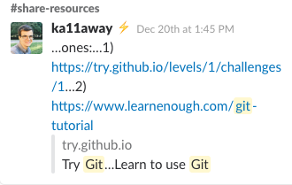

# 100 Days Of Code - Tailor Vijay - Log
My name is Tailor Vijay and I'm a digital nomad. I've taken the 100 Days of Code challenge on December 29th, 2017 and this is where I publish my daily progress. 

[Work Plan](https://github.com/tailorvj/100-days-of-code/blob/master/workplan.md) - It evolves on a daily basis, but basically rotates around React Web, Native and VR. 

I'm a media strategist, so I have a tendency to be very well planned and organized. I start slowly and pick up speed as I go, based on real progress.

[My Twitter updates](https://twitter.com/tailorvj)

01001010111010101001010100101001010010101001010100101011

## Day 14: January 13, 2018 - JavaScript basics and tools in the wild, Beaker P2P web and DAT protocol


### **Today's Progress**:

Read a couple of articles about ES6 arrow functions and Objects. Located a couple of cool tools for Array and Object examination. 

#### null == undefined, but null !== undefined

null and undefined are different types in JavaScript.

* null is identified by JS as object, while undefined is identified as a primitive. They are not the same type.
* They are both evaluated as false in a logical test.

For example, the following code will print into the console:

```
var n = null;
var u; //undefined because a value hasn't been assigned to u

if (!(n || u)){
	console.log(n); //null
	console.log(u); //undefined
	console.log("both null and undefined are false");
}
else {
	console.log("this will not happen, since both are evaluated as false");
}
```

#### Arrow functions

Have 2 main features:
1. A shorter syntax then typical functions
2. No binding of `this` 

```
function myFunctionAddsOne(myParam){
	return myParam++;
}
```

is equal to 

```
const myFunctionAddsOne = myParam => myParam++;
var shouldBeEqualTo4 = myFunctionAddsOne(3);
console.log(shouldBeEqualTo4);
```

The above is a very simplistic example though, that doesn't represent the full power of arrow functions. They really shine when defining anonymous functions within other functions. 

```
function Counter() {
  	this.num = 0;
  	
	this.timer = setInterval(() => {
	    this.num++;
	    console.log(this.num);
	  }, 1000);
}
```

When creating a new instance of Counter(), we get

```
var d = new Counter();
// 1
// 2
// 3
// ...
```

don't forget to

```
clearInterval(d.timer);
// to stop the eternal loop from running every second
```


In the example above, using a regular anonymous function instead of

```
() => {....}
```

, would result in 

```
var b = new Counter();
// NaN
// NaN
// NaN
// ...
```

don't forget to

```
clearInterval(b.timer);
// to stop the eternal loop from running every second
```

The arrow function format

```
() => {....}
```

keeps `this` in the context of the mother function it is defined within. 

Found 2 useful tools for Object and Array exploration:
[JavaScript Object Explorer](https://sdras.github.io/object-explorer/) and [JavaScript Array Explorer](https://sdras.github.io/array-explorer/) by [Sarah Drasner](https://twitter.com/sarah_edo)

#### Beaker dat P2P websites and web apps

Installed Beaker Browser and looked into it a little bit. Registered to dat://fritter.hashbase.io and followed some users there. 

Reading about @taravancil's dat-https workflow for publishing a website using hugo, dat and dathttpd to both DAT (Bearker P2P network) and https (WWW) using the same codebase. She is the coder of Fritter. 

### **Thougts**:

Taking a little trip into the wilderness during the weekend is a nice thing to do. So reading and documenting some extra basic JS knowledge makes me feel good. Although I feel like I have to put in some effort into freecodecamp and CodeAcademy as well. I might do that as well :)

I'd like to start moving and manipulating data between arrays and objects and build some utility functions of my own. 

I've already forgotten a few things I've learned in the past couple of weeks and it feels like I need some practice that integrates all of my previous knowledge. I'm considering writing my own quizzes on top of the basic quizzes provided by learning platforms. Memory works best when you use things on a daily basis and integrate new knowledge with previous concepts. 

The location changing effect: I have a lot more social interactions in Hanoi than in Kaohsiung, It makes it harder for me to make time for studying, so I guess I'm going to have to focus and make sure I don't drop this challenge. 
On top of that, it's a busy time with my various work projects. I keep telling myself "This is important, you can make it!".

Beaker seems to be super interesting as a P2P extension of the web. It has potential to become it's own ecosystem. I should research it further and experiment with it.

Fritter, the P2P Twitter clone, is reason enough to start using it on a daily basis I guess. I think my JavaScript knowledge might be put into good use there eventually. 
I have found Fritter to be pretty limited though, and saying it is a Twitter clone is very far from reality at the moment of writing, because it doesn't support the most basic features of Twitter, such as #hashtags, @mentions and RT's. 

### **Link to work**:

https://github.com/tailorvj/100-days-of-code/tree/R1D14/log.md

## Day 13: January 12, 2018 - Day off for organizing in Hanoi

### **Today's Progress**:

I've just move to Hanoi on Wednesday and I needed some time to recover from travel and organize necessities in the new location. 

The night before I'd actually forgotten to push and tweet, so I did that in the morning. 

### **Thoughts**:

Traveling is something I like doing once a month max. Once in 2 or 3 months is even better. I love Hanoi!!!

Running a github branch-commit-merge-push sequence in just a few seconds makes me smile :)

### **Link to work**:

https://github.com/tailorvj/100-days-of-code/tree/R1D13/log.md


## Day 12: January 11, 2018 - JS program flow control on freecodecamp.org - 81 challenges done so far


### **Today's Progress**:

More program flow control, this time with https://www.freecodecamp.org

if, else if, else code blocks.

switch-case value+type comparison block:

```
switch(val){
	case x: //val === x
		//do something;
		break;
	case y: //val === y
		//do something else;
		break;
	case z: //val === z
		//do something different;
		break;
	default:
		//do something unanticipated;
}
```

I learned a basic blackjack card counting technique. 

### **Thoughts**:

Always nice to get back to the basics. Challenges are getting more complex and take more time. I need a better system for repetition, such as flash cards. 

### **Link to work**:

https://www.freecodecamp.org/tailorvj
https://github.com/tailorvj/100-days-of-code/tree/R1D12/log.md

## Day 11: January 10, 2018 - JS program flow control

I tried to resume my lesson on CodeAcademy and got a 10 question quiz, so I took it ;)


### **Today's Progress**:

Did some program flow control lessons on CodeAcademy. 

Read about Github integration in Atom text editor and how to use it as a MarkDown editor. I will try it in the next few days and see whether I like it better than MWeb. 

### **Thoughts**:

Jumping between free code camp and code academy is good practice, because I can learn the same material twice without getting bored. 

I don't know if I'm into starting to manage an editor like Atom. It seems too full of add-ons. 

### **Link to work**:

https://github.com/tailorvj/100-days-of-code/tree/R1D11/log.md

## Day 10: January 9, 2018 - How to deal with Git merge conflicts


### **Today's Progress**:

Yesterday I had an unplanned merge conflict. First, I have to be able to recreate the problem:

* I branched from master into R1D9
* updated log.md
* added an image to the images folder
* added and committed
* pushed to origin R1D9
* I realized I had the wrong image reference in the log.md file
* I decided to --amend the local commit
* tried to push origin again and had a conflict
* then tried to merge into master and had another conflict
* i tried the mergetool but it was too cryptic for me, especially since it is based on vim
* So I didn't really understand what to do
* I tried all kinds of things, including another commit, file removal and finally, somehow, got my code committed, but became frustrated from not understanding what's going one with my code history.

So, git commits, merges and merge conflicts, what's up with you?

Started reading chapter 3 of Pro Git book to have a deeper understanding of branching.

#### Branching, checking out and the HEAD pointer

Basically, git creates a snapshot every time we commit what's on the stage in the current branch. The HEAD is pointing to one snapshot on our local machine at a time. 

It is encouraged to branch many times during a normal work day, to test various features in your code, before you merge it into master and push to server. 

Merging is supposed to be easy, you simple have to understand what's the status of your branches, your commits and where the HEAD is currently at. Your working directory represents the file state of the branch your are currently on. 

You only see one working directory, but its' contents are changing according to the branch and snapshot you are on at each moment. 

Contents of a file in a text editor that is not well aware of git behavior, may be different than the contents of that file on disk when you checkout another branch than the one you were working on when the file was opened. 


This has actually happened to me with MWeb Lite, the MarkDown editor I'm using for log authoring. I guess I should be more conservative with it from now on - opening and closing files before and after each checkout operation. 

#### Branching and merging workflow example

Steps:
1. Do work on a website.
2. Create a branch for a new feature.
3. Do some work in that branch.
4. Revert back to your production branch.
5. Create a branch to add a hotfix. 
6. After it's tested, merge the hotfix branch, and push to production.
7. Switch back to your original story and continue working.

```
$ cd website-folder
$ git checkout -b featurex
$ git commit -a -m "I'm working on this feature. Haven't finished yet, but committing for the sake of sanity"
$ git checkout master
$ git checkout -b hotfix
$ git commit -a -m "hotfix applied and tested"
$ git checkout master
$ git merge hotfix
$ git push origin master
$ git checkout featurex
```

This is a basic scenario in which a commit is done every time you want to move between branches. There are more complex scenarios than that, but this is what I'll stick to at this point, until I learn how to perform more complex scenarios.

### **Thoughts**:

I tried to move forward based on incomplete knowledge and got bitten :) I'm not afraid of that, as it's a great opportunity to dive deeper and better understand what I'm dealing with. 

My next move with git will be to further investigate my rollback, snapshot, HEAD and merge conflict resolution techniques. It seems like a great system. I would definitely like to be able to help teams collaborate around code with it, but they will need some education before it can actually happen in an efficient manner.

### **Link to work**:

https://github.com/tailorvj/100-days-of-code/tree/R1D10/log.md

## Day 9: January 8, 2018 - 36 more challenges on free code camp and a weird git problem


### **Today's Progress**:

Continued free code camp challenges from 36, up to challenge 73.

Challenges passed:

* Shopping List
* Write Reusable JavaScript with Functions
* Passing Values to Functions with Arguments
* Global Scope and Functions
* Local Scope and Functions
* Global vs Local Scope in Functions
* Return a Value from a Function with Return
* Assignment with a Returned Value
* Stand in Line
* Understanding Boolean Values
* Use Conditional Logic with If Statements
* Comparison with the Equality Operator
* Comparison with the Strict Equality Operator
* Comparison with the Inequality Operator
* Comparison with the Strict Inequality Operator
* Comparison with the Greater Than Operator
* Comparison with the Greater Than Or Equal To Operator
* Comparison with the Less Than Operator
* Comparison with the Less Than Or Equal To Operator
* Comparisons with the Logical And Operator
* Comparisons with the Logical Or Operator
* Introducing Else Statements
* Introducing Else If Statements
* Logical Order in If Else Statements
* Chaining If Else Statements

Array manipulation:

* **arrayVariable.push(x)** adds the value of x into the end of arrayVariable.
* **var x = arrayVariable.pop()** removes the last member of arrayVariable and stores the removed member in x.
* **var x = arrayVariable.shift()** removes the first member of arrayVariable and stores the removed member in x.
* **arrayVariable.unshift(x)** add the value of into the beginning of arrayVariable.

```
var myArray = [[00,01],[10, 11]];
myArray.push([20, 21]);
//myArray now holds [[00,01],[10, 11],[20, 21]]

var popValue = myArray.pop();
//myArray now holds  [[00,01],[10, 11]]
//popValue now holds [20, 21]

var shiftValue = myArray.shift();
//myArray now holds [10, 11]
//shiftValue now holds [00,01]

myArray.unshift(shiftValue);
//myArray now holds  [[00,01],[10, 11]]
```

a queue function

```
function nextInLine(arr, item){
	arr.push(item); //adds item to the end of the array
	return arr.shift(); //removes the first item from the array and returns it;
}
```

### **Thoughts**:

I like the interactive nature of both free code camp and CodeAcademy. 

I wanted to git commit --amend because of a last minute change to the log, but trying to push to origin R1D9 said I should do a pull before that. I did, but the MarkDown editor still showed the file as it was on my hard drive before the git pull. I saved the file again and expected to a change in git status, but nothing, I'm a bit confused. I will have to research this issue further tomorrow. Weird stuff!!!

### **Link to work**:

https://www.freecodecamp.org/tailorvj
https://github.com/tailorvj/100-days-of-code/tree/R1D9/log.md

## Day 8: January 7, 2018 - No progress, too much work

### **Today's Progress**:

I actually used 

```
$ git checkout -b R1D8
```

Instead of 

```
$ git branch R1D8
$ git checkout R1D8
```

to write this log, without hesitation, as if I've typed it a million times before :)

### **Thoughts**:

I have to learn how to say no to spontaneous client hangouts. I'll try to get into coding during the day from now on and wrap it up at night by publishing the log.

### **Link to work**: 

https://github.com/tailorvj/100-days-of-code/tree/R1D8/log.md

## Day 7: January 6, 2018 - Complete CodeAcademy JavaScript Introduction, Started taking egghead.io's How to Contribute to an Open Source Project on GitHub. Jet-lag adaptation

### **Today's Progress**:

I've had to adapt my sleeping hours due to jet-lag, so date has moved one day forward and now each day of January is one number behind the day of coding :) (January 6th = R1D7)

**Tip of the day**: Don't fly between Europe and Far East too often. 

#### Completed JavaScript Introduction module by CodeAcademy.com. 

Today's lesson: [Code Academy - Variables](https://www.codecademy.com/en/courses/learn-javascript-introduction/lessons/variables/exercises/intro-variables)


```
const constantName = 'constant value and type';
constantName = 'this throws an error'; //throws a TypeError: Assignment to constant variable.

let variableName = 'variable value and possibly type';
variableName = true; //this is ok, because variableName is a variable declared with let
```

JavaScript type **undefined**

```
let unsetVariable;
console.log(unsetVariable); //prints undefined to the console
```

ES6 string interpolation using backticks


```
let myName = 'Tailor'; //assigned using single quotes
let myCity = 'Hanoi';

//backticks ` are not single quotes '
//ES6 string interpolation is done using backticks `text ${variableName}`
console.log(`My name is ${myName}. My favorite city is ${myCity}.`);
```


#### [How to contribute to a Github project](https://egghead.io/courses/how-to-contribute-to-an-open-source-project-on-github)

A very practical guide to actual contribution to projects on Github, using the web interface and git command line.

**Tip:** In every Github repo you would like to contribute too, try to locate contribution related info. It would be a shame to fix a bug, then realize the original author would not accept it. Look for a CONTRIBUTING.md file in every repo before you write any code.

* Forked https://github.com/eggheadio-github/stack-overflow-copy-paste

```
$ git clone git@github.com:tailorvj/stack-overflow-copy-paste.git
$ cd stack-overflow-copy-paste
```

**New command!!!**

This adds the original repo I forked from, as an origin repo to which I can send pull requests from the command line.

```
$ git remote add upstream https://github.com/eggheadio-github/stack-overflow-copy-paste.git
```

To get information about the upstream remote

```
$ git fetch upstream
```

Then, to make the local repo track changes on the upstream repo instead of our forked origin

```
$ git branch --set-upstream-to=upstream/master master
```

Now checkout a new branch (-b) locally

```
$ git checkout -b pr/padLeft
```

install project and run tests and build

```
$ npm install
$ npm t && npm run build
```

Tomorrow I'll complete this excellent git contribution tutrial. Cheers, Tailor.

### **Thoughts**:

I'm still quite bored with the JavaScript level, but new features in ES6, such as const, let and string interpolation using backticks are just one example of new language features I should be aware of if I want to develop modern web apps. 

I'm starting to see the light with git and Github, which means I can better collaborate with others after just a few days of commitment to this process. egghead.io's tutorial is great.

Console based tutorials are more efficient. 

### **Link to work**: 

https://github.com/tailorvj/stack-overflow-copy-paste

https://github.com/tailorvj/100-days-of-code/tree/R1D7/log.md

## Day 6: January 5, 2018 - Git knowhow is getting stable, started a daily JS routine 36 challenges on free code camp


### **Today's Progress**:

Added https://www.freecodecamp.org to my daily JS routine, on top of https://www.codeacademy.com.

JavaScript dojo:

According to [free code camp](https://www.freecodecamp.org/challenges/declare-javascript-variables), there are 7 types of data in JavaScript nowadays. 

Just a few days ago I came across a (not so old) course that said there were 4 data types. The updated version is (new ones in **bold**):

* **undefined**, 
* null, 
* boolean, 
* string, 
* **symbol**, 
* number, 
* and **object**.

Variable initialization and assigninment:

```
var a = 7;
var b = a;
```

Uninitialized variables are of type undefined;

```
var someVar; //is undefined
/*
Adding a string to an undefined variable will present "undefined" as part of the resulting string. 
Adding a number to undefined with result in NaN (Not a Number)
*/
```

```
myVar = 7;
myVar++ ;// is the same as myVar = myVar + 1;
```

### **Thoughts**:

After skipping another day this week, I must admit that I still remember my Git branching, committing, pushing and merging routine pretty well. 

I would like to start learning how to cope with merge conflicts. Need a group of collaborators for this. 

It can be very boring to learn JavaScript from scratch, but I'm glad I do, because when I studied, back in 1996, it was a whole different eco-system and there were hardly any other web programmers around me. When I worked as a webmaster in Microsoft WebTV R&D in 2001, it was still referred to as Dynamic HTML. No one did web apps, even Ajax wasn't there yet, and definitely no one was talking about JSON. I kept on developing web products and then moved to more product and media work, but never really had to the chance to go back to the basics and build a formal understanding of the modern JS. So, as boring as it may be, I'm starting off from the very basics and building from there. 

Believe in the process!!!

### **Link to work**: 

https://github.com/tailorvj/100-days-of-code/tree/R1D6


## Day 5: January 3, 2018

### **Today's Progress**:

* None. 2nd late night work day this week. 

### **Thoughts**:

I must stop working so hard?! Phew

## Day 4: January 2, 2018 - Local and remote git branching and merging from the command line like a boss

### **Today's Progress**:

After a couple of sessions with sessions on https://try.github.io/levels/1/challenges/1 and using http://rogerdudler.github.io/git-guide/ as reference, I started branching and merging local and remote with confidence from the command line. 

Added the guide as a resource in my Trello board.

Just for the sake of good order, since this is the first time I've managed to do branching and merging from the git command line, here is the list of commands I used to publish this update on the Github repo:

```
$ git branch R1D4
$ git checkout R1D4
$ git commit -a -m "R1D4 log update"
$ git status
status said a file was created but not staged, so I staged it and committed again
$ git add images/20180102-codeacademy-progress.png
$ git commit -a -m "R1D4 log update. added missing image"
$ git push origin R1D4
$ git checkout master
$ git merge R1D4
$ git push origin master
```

Added .DS_Store to .gitignore

I think it's time for a little JS challenge :)

CodeAcademy has an [interactive basic JavaScript tutorial](https://www.codecademy.com/courses/learn-javascript-introduction/lessons/introduction-to-javascript/exercises/intro). Let's see what's going on there:

```
console.log('any string');
```

#### Data types

* Strings ('anything inside quotation marks, single or double')
* Numbers (any number, including floating point)
* Booleans
* null

I actually remember reading that in ES6 there are 5 data types. I'll look into it later. 

#### Math operators (for numbers)

1.	Add: +
2.	Subtract: -
3.	Multiply: *
4.	Divide: /

#### Built-in JavaScript objects

**String.prototype** (Instance required) properties and methods() [MDN String reference](https://developer.mozilla.org/en-US/docs/Web/JavaScript/Reference/Global_Objects/String/prototype):

* .toUpperCase()
* .startsWith()
* .length
* .trim()

**Math** (Library, no instance required) object methods() [MDN Math reference](https://developer.mozilla.org/en-US/docs/Web/JavaScript/Reference/Global_Objects/Math)

* Math.random()
* Math.floor(x)
* Math.ceil(x)

**Number** (Library, no instance required) object methods() [MDN Number reference](https://developer.mozilla.org/en-US/docs/Web/JavaScript/Reference/Global_Objects/Number)

* .isInteger(x)

```
// single line comment

/*
multi
line
comment
*/
```

### Thoughts

Interactive tutorials with good visual reference material to back it up while I work, combined with some Googling, seems to be the right combination for me. 

I've been pondering the creation of a flash card collection for memorization purposes, but daily practice is also great. Maybe I'll develop an app for that later. 

Anyhow, It feels good to go back to the basics. 

### **Link to work**: 

https://github.com/tailorvj/100-days-of-code/tree/R1D4


## Day 3: January 1, 2018 - Happy New Year!!!

### **Today's Progress**:

* None. I was just working on a last minute project until I was done, which was way too late at night. The client was happy with the result though and I felt satisfied for actually making it in one go :) I hope this doesn't mean I'm going to be working late nights all year long though. 

### Thoughts

I'm going to have such days every now and then and there's nothing I can do about it. Work always comes first. I felt bad about it, but it's not like I was slacking or anything, just doing my job, which is fine. This gives me an opportunity to do double branch merging and pushing on R1D4

### **Link to work**: 

https://github.com/tailorvj/100-days-of-code/tree/R1D3


## Day 2: December 31, 2017 - Happy New Year!!!

### **Today's Progress**: 

* Organized my learning resources in a Trello board. 
* Found (after struggling with git command line. see below) this [interactive basic git command line tutorial by Github](https://try.github.io/levels/1/challenges/1) 

#### Cloned my 100DaysOfCode repo to my MacBook via Git command line (partial success) and Github GUI for Mac.
[Display git branch name (link to source)](https://coderwall.com/p/fasnya/add-git-branch-name-to-bash-prompt)

Add following lines to your ~/.bash_profile - **I don't think this has worked actually**.

```
parse_git_branch() {
     git branch 2> /dev/null | sed -e '/^[^*]/d' -e 's/* \(.*\)/ (\1)/'
}
export PS1="\u@\h \[\033[32m\]\w\[\033[33m\]\$(parse_git_branch)\[\033[00m\] $ "
```

Clone the 100-days-of-code repo to my MacBook. Open terminal and type:
```
$ cd workspace
$ git clone git@github.com:tailorvj/100-days-of-code.git
```

This didn't work as is. I have to set my public key for this system to work with my github account. 

[Generating a SSH key from the terminal](https://help.github.com/articles/generating-a-new-ssh-key-and-adding-it-to-the-ssh-agent/)
```
$ ssh-keygen -t rsa -b 4096 -C "emailadderss@domain.com"
```
Saved it to the default file name then created a passphrase. 

**Add to ssh-agent**

- [x] Start the ssh-agent in the background

```
$ eval "$(ssh-agent -s)"
Agent pid 50505
```
- [x] automatically load keys into the ssh-agent and store passphrases in your keychain. edit `~/.ssh/config`

```
Host *
 AddKeysToAgent yes
 UseKeychain yes
 IdentityFile ~/.ssh/id_rsa
```
 
- [x] Add your SSH private key to the ssh-agent and store your passphrase in the keychain.

```
$ ssh-add -K ~/.ssh/id_rsa
```
[Adding a new SSH key to your GitHub account](https://help.github.com/articles/adding-a-new-ssh-key-to-your-github-account/)

```
pbcopy < ~/.ssh/id_rsa.pub
```

Created a new SSH key in my Github settings, pasted the fingerprint and saved. - Yayy (Where is the AI that saves us from all that?). Anyway, I should be good to do my github cloning now. **YES, it workded!**

```
$ cd 100-days-of-code
$ ls
```

TODO: after branching, upload screenshot to repo, merge and use the image link here instead of the placeholder


All the files are there indeed. I've already created a R1D2 branch, so now is the time to 

* switch to R1D2 branch 

Started following [Working with branches in Git](http://genomewiki.ucsc.edu/index.php/Working_with_branches_in_Git) wiki page.

```
$ git checkout R1D2
```

Stopped here and downloaded https://desktop.github.com/ 

I hope the following screenshots can portray how important visual feedback is when it comes to such complex processes:


 

See my thoughts for today about this.

Next moves (not today):

* make my daily changes in the branch via command line git.
* create pull request.
* evaluate pull request.
* merge into master.

### Thoughts

I have to admit the concept of Git branching is pretty awesome, but it feels like git command line tool makes life hard for you in general and specifically when it comes to distinguishing exactly what you are working on and how to make the process of cloning from a remote repo, branching, then merging locally, then to the remote repo again, actually work. I will go into it again tomorrow maybe, but for now I'm going to make this commit via the Github GUI client.

After all of this struggle, I went into [#share-resources 100DaysOfCode slack channel](https://100xcode.slack.com/messages/C7F3MT7D2/search/git/) and searched for git. And voila! @ka11away to the rescue. Thanks buddy for the interactive git command line tutorials. 



I'm starting to see the added value of this documentation process. Collecting and organizing learning resources for this kind of learning process is time consuming. 

### **Link to work**: 

https://github.com/tailorvj/100-days-of-code/tree/R1D2

## Day 1: December 30, 2017

### **Today's Progress**: Read Pro Git and did Github.com's hello-world tutorial

#### I've learned and implemented the basics of Git and Github


The [Github hello-world tutorial](https://guides.github.com/activities/hello-world/) teaches you these basic concepts:
* Create an open source repository
* Start and manage a new branch
* Change a file and commit those changes to GitHub
* Open and merge a Pull Request

I've immediately implemented what I've learned on this repo by creating a [branch for R1D1 Log update](https://github.com/tailorvj/100-days-of-code/tree/R1D1) and merging it into master after I was done editing. 

Pro Git chapter 2 goes a lot deeper (and I have not finished the chapter yet):
##### Git basics
* Configure a repo
* Initialize
* Begin and stop tracking files
* Stage and commit changes
* Ignore certain files and file patterns
* Undo mistakes
* Browse project history
* View changes between commits
* Push and pull from remote repos

```
$ git init to start tracking changes in the current directory
$ git add *.c starts tracking all files with a .c extension in the current repo
$ git add README starts tracking changes to the README file in the current repo
$ got commit -m 'initial project version' commits changes in all tracked files to a version (called a commit)
$ git clone [url] clones the entire repo from URL including entire commit history to the local computer
$ git clone [url] foldername clones the project folder to a folder named foldername instead of the original folder name
```
Possible states of tracked files: unmodified ->modified then -> staged. There is a cycle here.
```
$ git status tells you in which state your files are, on which branch you are and if you have any untracked files.
$ git add filename/foldername to start tracking file filename or the entire folder foldername.
$ git add filename/pattern should be used to stage files for commit every time a change is made and you wish to preserve it on the next commit/snapshot
.gitignore file lists patterns for files to ignore.
Excercise: experiment with different glob patterns in .gitignore files in different fake repos.
$ git commit -m "commit message" commits staged changes into a snapshot
$ git -a -m "commit message" stages and commits all modified tracked files.
To add a last minute file to your recent commit
$ git add filename 
$ git commit --amend
$ git remote give you a list remote servers you are working with
$ git remote -v gives you their url's as well
$ git remote add remoteshortname URL adds a remote from URL and gives it the name remoteshortname.
$ git fetch remoteshortname gets all the different branches from the remote defined as remoteshortname
$ git push origin master pushes you latest commit on branch master to the server you originally cloned from (if you have write access)
```

### Thoughts

Github.com's tutorial has been a lot more effective in both time and effect. I've tried it hands on and immediately put into good use on this very repo. I should be looking for more resources like it and less resources like the Pro Git book, which is concise, but seems like an overkill and a time hog. 

MWeb Lite is a good Markdown editor for Mac OS X. I'm going to keep on using it to edit my MarkDown for theses updates. 

Updating takes a lot more time than it should. 

### **Link to work**: 

https://github.com/tailorvj/hello-world

## Day 0: December 29, 2017

### **Today's Progress**: Committing, Planning, Setting up shop

I’ve publicly committed to #100DaysOfCode on Twitter

Permalink: [https://twitter.com/tailorvj/status/946747480695128064](https://twitter.com/tailorvj/status/946747480695128064) 


#### Markdown for the Github repo Log

I installed MWeb Lite app on my Macbook to be able to write MarkDown pages for the Github repo. Haven’t tested it yet, but it’s free, so I’ll look into it first, then make a decision about further steps. 

I’ve also installed a Google Drive script that converts Docs to Markdown and emails them to you. It’s been tested and looks very promising. I think it would be easiest for me to document my progress in a Google Doc, then convert it to MarkDown and publish on the Github repo. 

[https://github.com/mangini/gdocs2md](https://github.com/mangini/gdocs2md) 

### Thoughts

I can actually dive into this for hours unending, which is not what I’m trying to achieve here. This is a medium range project, so after initial push I’d like to stick to one hour a day. I’ve installed a pomodoro timer app on the Macbook to make sure I don’t go beyond the 1 hour limit. I’ll do 2x25 minute sessions every day, with a 5 minute break between them. 

Daily blogging will be done in the last 5 minutes of each day and if I feel like elaborating more about my experience, I may do a longer weekly recap blog post. 

My plan is to get back to the basics of web development and move up from there. First step: Git and Github. 

I have the kindle book Pro Git, which has a very thorough approach towards Git. Tomorrow I would like to read chapter 2 of it, but before I do that, I’m going to run through Github’s own Hello World hands-on tutorial

[https://guides.github.com/activities/hello-world/](https://guides.github.com/activities/hello-world/) 

### **Link to work**: 

none

